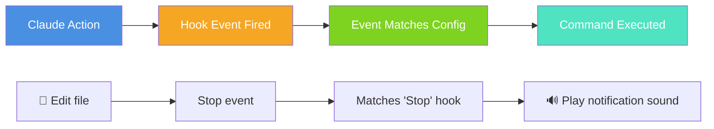
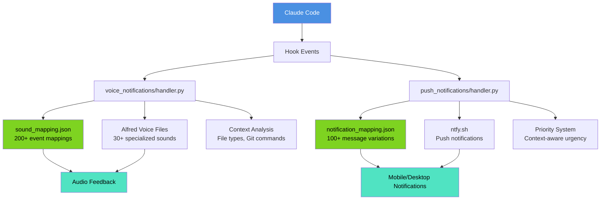
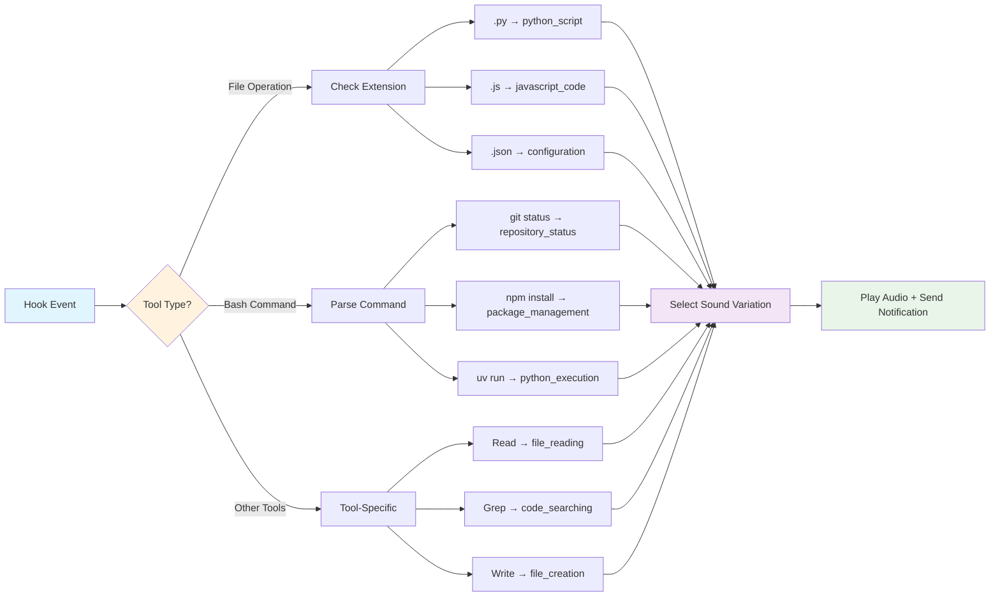

# Claude Code Hooks: Dual Notification System Tutorial

**Goal**: Build a sophisticated dual notification system (voice + push) with 200+ event mappings and context-aware intelligence

## 📱 What You'll Build

By the end of this tutorial, viewers will have:

### **🔊 Voice Notification System**

- Alfred voice assistant providing immediate audio feedback
- 30+ specialized sounds for different operations
- Context-aware sound selection based on file types and commands
- Graceful fallback system for missing audio files

### **📲 Push Notification System**

- Mobile/desktop notifications via ntfy.sh
- Remote monitoring when away from development environment
- Priority-based notification levels for different events
- 100+ message variations with context intelligence

### **🧠 Context-Aware Intelligence**

- File extension pattern matching (Python, JS, Markdown, JSON)
- Git command recognition (status, commit, push, pull)
- Error handling with specialized audio cues
- Tool operation feedback with appropriate sounds/messages

---

## 📝 Step-by-Step Tutorial

### **Step 1: What Are Claude Code Hooks?**

Claude Code hooks are event listeners that trigger when Claude performs specific actions - like reading files, running commands, or completing tasks.

**🔄 Hook Event Flow**:



**🛠️ Hook Configuration Structure**:

```json
{
  "hooks": {
    "<event-name>": [
      {
        "matcher": "<tool-pattern>",
        "hooks": [
          {
            "type": "command",
            "command": "your-command-here"
          }
        ]
      }
    ]
  }
}
```

**Key Concepts**:

1. **Event firing**: Every time Claude does something, it fires an event
2. **Event types**: Stop, PreToolUse, PostToolUse, Notification, UserPromptSubmit
3. **Matcher patterns**: How to filter specific tools or commands
4. **Command execution**: How your custom scripts get triggered

**📋 Real Example**:

```json
{
  "hooks": {
    "Stop": [
      {
        "hooks": [
          {
            "command": "echo 'Claude finished a task!'"
          }
        ]
      }
    ]
  }
}
```

**What You'll Learn**:

- Understanding of hooks as event-driven automation
- Knowledge of basic configuration structure
- Foundation to build sophisticated notification system

---

### **Step 2: The Problem & Solution**

**The Problem**: When using Claude Code, you often don't know what's happening. You're switching between tabs, checking your terminal, refreshing GitHub... wondering 'What's Claude doing right now?'

**The Solution**: A dual notification system that tells you exactly what Claude Code is doing in real-time through voice and mobile notifications.

### **Step 3: The Dual Notification Architecture**

**🗂️ Architecture Diagram**:



This isn't just playing random sounds - it's a sophisticated 200+ event mapping system with context-aware intelligence.

**System Components**:

1. `.claude/hooks/` directory structure
2. `voice_notifications/sound_mapping.json` - 200+ event mappings
3. `push_notifications/notification_mapping.json` - message variations
4. Intelligent mapping logic in handler.py files
5. Modular architecture with separate logging

**Explore the Structure**:

```bash
# Show the hook structure
ls -la .claude/hooks/
```

**💻 Code Snippet - Context-Aware Sound Selection**:

```python
def _get_context_sound(mapping: SoundMapping, tool_name: str, tool_input: ToolInput) -> str | None:
    """Get context-specific sound based on file extensions, filenames, or command patterns."""
    context_patterns = mapping.get("context_patterns", {})

    # Handle file operations (Read, Edit, Write)
    if tool_name in ["Read", "Edit", "Write", "MultiEdit", "NotebookRead", "NotebookEdit"]:
        return _get_file_operation_sound(context_patterns, tool_name, tool_input)

    # Handle bash commands
    if tool_name == "Bash":
        return _get_bash_command_sound(context_patterns, tool_input)

    return None
```

---

### **Step 4: Setting Up Voice Notifications**

Alfred serves as your voice assistant with over 30 specialized sounds for different operations. Here's how to set it up:

**Configuration Steps**:

1. Install uv package manager from Astral
2. Configure `.claude/settings.json`
3. Set up hook events: Stop, PreToolUse, Notification
4. Understand the graceful fallback system
5. Test the voice system

**Testing Commands**:

```bash
# Test voice notifications manually
echo '{"hook_event_name": "Stop"}' | uv run .claude/hooks/voice_notifications/handler.py --voice=alfred

# Test with specific tool context
echo '{"hook_event_name": "PreToolUse", "tool_name": "Edit", "tool_input": {"file_path": "test.py"}}' | uv run .claude/hooks/voice_notifications/handler.py --voice=alfred --debug
```

**Configuration Example**:

```json
{
  "hooks": {
    "Stop": [
      {
        "hooks": [
          {
            "command": "uv run .claude/hooks/voice_notifications/handler.py --voice=alfred"
          }
        ]
      }
    ],
    "PreToolUse": [
      {
        "hooks": [
          {
            "command": "uv run .claude/hooks/voice_notifications/handler.py --voice=alfred"
          }
        ]
      }
    ],
    "Notification": [
      {
        "hooks": [
          {
            "command": "uv run .claude/hooks/voice_notifications/handler.py --voice=alfred"
          }
        ]
      }
    ]
  }
}
```

**💻 Code Snippet - Graceful Fallback System**:

```python
def play_sound(sound_name: str, voice: str, logger: logging.Logger) -> None:
    """Play sound with graceful fallbacks for missing files."""
    try:
        # Try specific voice/sound combination first (mp3 then wav)
        mp3_path = script_dir / "sounds" / voice / f"{sound_name}.mp3"
        wav_path = script_dir / "sounds" / voice / f"{sound_name}.wav"

        if mp3_path.exists():
            sound_path = mp3_path
        elif wav_path.exists():
            sound_path = wav_path
        else:
            # Direct fallback to chime.mp3 (more pleasant than ding)
            chime_path = script_dir / "sounds" / "chime.mp3"
            if chime_path.exists():
                sound_path = chime_path
                logger.warning(f"Using chime fallback: {sound_path}")
            else:
                logger.error("All fallbacks failed")
                print("\a", end="", flush=True)  # Terminal bell fallback
                return
```

**What You Should See**:

- Voice notifications playing appropriate sounds
- Proper settings.json configuration working
- Alfred responding to different hook events

---

### **Step 5: Adding Push Notifications**

Voice notifications are great when you're at your computer, but what about when you're away? Push notifications via ntfy.sh solve this - it's free, works on any device, and requires zero setup.

**Setup Steps**:

1. Set up ntfy.sh subscription on mobile device
2. Update `.claude/settings.json` to include push notifications
3. Test push notifications with different priorities

**Testing Commands**:

```bash
# Test push notifications
echo '{"hook_event_name": "Stop"}' | uv run .claude/hooks/push_notifications/handler.py --topic=claude-code-notifications

# Test with high priority notification
echo '{"hook_event_name": "Notification", "message": "Permission request"}' | uv run .claude/hooks/push_notifications/handler.py --topic=claude-code-notifications --priority=4 --tags=🔔
```

**Updated Configuration**:

```json
{
  "hooks": {
    "Stop": [
      {
        "hooks": [
          {
            "command": "uv run .claude/hooks/voice_notifications/handler.py --voice=alfred"
          },
          {
            "command": "uv run .claude/hooks/push_notifications/handler.py --topic=claude-code-notifications"
          }
        ]
      }
    ]
  }
}
```

**Expected Results**:

- Mobile device receiving push notifications
- Both systems working together seamlessly
- Understanding of priority levels and custom topics

---

### **Step 6: Context-Aware Intelligence**

The system is smarter than basic sound alerts - it analyzes what you're doing and responds appropriately.

**🧠 Context-Aware Flow Diagram**:



**How It Works**:

**File Type Intelligence**: The system recognizes different file types:

- Edit a Python file → "Updating Python script"
- Edit a JavaScript file → "Modifying JavaScript code"
- Edit a JSON file → "Updating configuration"

**Example Commands to Try**:

```
# Edit Python file - triggers Python-specific notifications
Edit this Python file to add a new function.

# Edit JavaScript file - triggers JS-specific notifications
Fix the React component in this JavaScript file.

# Git operations - triggers git-specific sounds
Run git status and commit these changes.
```

**Git Command Recognition**:

- Git status → "Checking repository status"
- Git commit → "Committing changes"
- Git push → "Pushing to remote"

**Error Handling**:

- Errors trigger → Alfred says "I'm afraid there's been an issue"
- Graceful fallback system continues operation

**Tool-Specific Feedback**:

- Read tool → "Reading file"
- Grep tool → "Searching codebase"
- Bash tool → Command-specific responses

**What You'll Experience**:

- Context-aware intelligence in action
- Different sounds/messages for different file types and commands
- Robust error handling system

---

### **Step 7: Advanced Configuration & Customization**

The system is completely customizable. Want different sounds? Change the mapping. Need custom messages? Edit the JSON.

**Customization Areas**:

1. `sound_mapping.json` structure and modifications
2. Adding new sound variations
3. Custom topics for push notifications
4. Debug logging system

**Useful Commands**:

```bash
# Show debug logs
cat .claude/hooks/voice_notifications/debug.log

# Test with custom topic
echo '{"hook_event_name": "Stop"}' | uv run .claude/hooks/push_notifications/handler.py --topic=my-custom-topic --debug
```

**Customization Options**:

- Adding new sound files to the Alfred directory
- Modifying message variations in notification_mapping.json
- Creating custom hook events
- Setting up team notification topics

**What You'll Learn**:

- How to customize the system for your workflow
- System flexibility and extensibility
- Debugging and troubleshooting techniques

---

### **Step 8: Real-World Example - Demo App Enhancement**

The included video-idea-board app provides a perfect testing ground for the notification system. Try enhancing it in stages to experience how the system handles different file operations.

**Try This Workflow**:

**Stage 1 - Visual Enhancement**:
Ask Claude Code to upgrade the video cards with gradient backgrounds:

```
Claude, upgrade these video cards with beautiful gradient backgrounds instead of solid colors. Each video should have its own unique gradient theme.
```

**Expected Notifications**:

- Editing types.ts → Alfred: "Updating TypeScript definitions"
- Editing VideoCard.tsx → Alfred: "Updating React component"
- Editing videos.ts → Alfred: "Modifying video data"

**Stage 2 - Functional Enhancement**:
Add interactive modals:

```
Claude, add a modal system so when users click on video cards, they see a popup with full video descriptions and features.
```

**Expected Notifications**:

- Creating VideoModal.tsx → Alfred: "Creating modal component"
- Editing App.tsx → Alfred: "Updating React component"
- Multiple TypeScript files → Context-aware feedback

**What You'll Experience**:

- Different sounds for .ts vs .tsx files
- Context-aware messages for each operation
- Both voice and mobile notifications (if configured)
- Real-time feedback for every Claude action

---

### **Step 9: Troubleshooting & Pro Tips**

**Common Issues and Solutions**:

**Troubleshooting**:

- Debug logs location: `.claude/hooks/voice_notifications/debug.log`
- Fallback system when sounds are missing
- Network issues for push notifications

**Pro Tips**:

- Setting up team notification topics
- Using priority levels effectively
- Customizing for different projects
- Performance considerations

**⌨️ Troubleshooting Commands**:

```bash
# Check debug logs
tail -f .claude/hooks/voice_notifications/debug.log

# Test notification systems
echo '{"hook_event_name": "Stop"}' | uv run .claude/hooks/voice_notifications/handler.py --voice=alfred --debug
```

**✅ Expected Outcome**:

- Viewers know how to troubleshoot issues
- Understanding of best practices
- Confidence to implement the system

---

### **Step 10: Installation & Getting Started**

**Quick Setup Guide**:

1. Install uv package manager from Astral
2. Clone the repository from GitHub
3. Copy hook files to your `.claude/hooks/` directory
4. Update `.claude/settings.json` with hook configuration
5. Subscribe to ntfy.sh topic on your devices
6. Test both systems

**Demo App Setup**:

1. Navigate to `apps/video-idea-board/`
2. Run `npm install` and `npm run dev`
3. Try the two-stage enhancement yourself
4. Experience the notifications firsthand

**Resources**:

- Complete repository with all code
- Step-by-step setup documentation
- ntfy.sh configuration guide
- Alfred sound files and installation

**⌨️ Setup Commands**:

```bash
# Install uv package manager from Astral
curl -LsSf https://astral.sh/uv/install.sh | sh
# Or on Windows: powershell -ExecutionPolicy ByPass -c "irm https://astral.sh/uv/install.ps1 | iex"
# Or with pip: pip install uv

# Clone the repository
git clone https://github.com/chongdashu/claude-code-mastery

# Set up the demo app
cd claude-code-mastery/apps/video-idea-board
npm install
npm run dev

# Test the hook system
echo '{"hook_event_name": "Stop"}' | uv run .claude/hooks/voice_notifications/handler.py --voice=alfred --debug
```

**Expected Outcome**:

- Complete implementation roadmap with working demo app
- Hands-on experience with workflow automation
- All resources needed to replicate the setup
- Confidence to build your own notification system

---

## 📊 Tutorial Summary

| Step | Focus Area                 | Key Learning                              |
| ---- | -------------------------- | ----------------------------------------- |
| 1    | Understanding Hooks        | Hook concepts and event-driven automation |
| 2    | Problem & Solution         | Pain points and notification benefits     |
| 3    | Architecture Overview      | Dual system concept and 200+ mappings     |
| 4    | Voice Notification Setup   | Alfred configuration and testing          |
| 5    | Push Notification Setup    | ntfy.sh integration and priorities        |
| 6    | Context-Aware Intelligence | File types, git commands, error handling  |
| 7    | Advanced Configuration     | JSON mapping, debugging, extensibility    |
| 8    | Real-World Demo            | Practical coding task with notifications  |
| 9    | Troubleshooting & Pro Tips | Debug logs, fallbacks, best practices     |
| 10   | Installation Guide         | Quick setup steps and resources           |

---

## 🔧 System Requirements

**Prerequisites**:

- **Astral uv package manager** installed (https://astral.sh/uv)
- Claude Code with hooks support
- Mobile device with ntfy.sh app (optional)
- Audio system for voice playback
